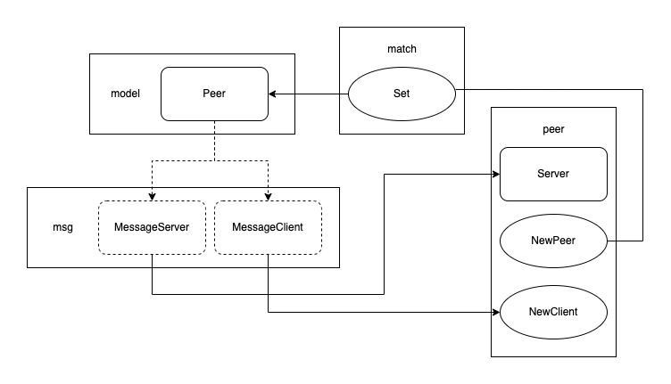

# grpc-peer

Peer node implementation with Golang and gRPC.

- Go1.19
- gRPC

## Role

| package | description                             |
| ------- | --------------------------------------- |
| logger  | Print colorized message                 |
| match   | Like DNS; Matching `ID` to `Peer`       |
| model   | Define struct `Peer`                    |
| msg     | Code generated by protoc-gen-go-grpc    |
| peer    | Implementation of `Server` and `Client` |
| main    | Make peers and run                      |

## Flow

1. `Client` of `SourcePeer` runs `MessageSend`.
2. `MessageSend` gets `DestinationPeer` from `match` using its `Id`.
3. `MessageSend` records the request to csv file.
4. `MessageSend` returns a response.
